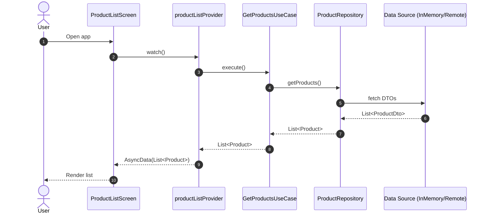

# SmartQuit IoT — Project Architecture & Guide

This document explains the architecture, data flow, folder structure, and conventions used in this Flutter project so new team members can quickly understand and extend the codebase.

### Tech Stack
- Flutter (UI)
- Riverpod 2.x (state management, dependency injection)
- Firebase (planned BaaS integration)

The architecture follows feature-first organization with Clean Architecture principles: separation of concerns, testability, and scalability.

## Folder Structure (Feature-First + Clean Architecture)

```text
lib/
├── app.dart                         # Root app widget (MaterialApp)
├── main.dart                        # Entrypoint, wraps app in ProviderScope
├── routes/
│   └── app_routes.dart              # Centralized named routes
├── core/                            # Cross-cutting concerns
│   ├── di/
│   │   └── injection.dart           # DI bootstrap placeholder
│   ├── errors/
│   │   └── exceptions.dart          # App-level exceptions
│   └── network/
│       └── api_client.dart          # API client placeholder
└── features/
    └── products/
        ├── data/
        │   ├── models/
        │   │   └── product_dto.dart
        │   └── product_repository.dart
        ├── domain/
        │   └── models/
        │       ├── product.dart
        │       └── product_category.dart
        ├── presentation/
        │   ├── controllers/
        │   │   └── product_list_controller.dart
        │   ├── screens/
        │   │   ├── product_list_screen.dart
        │   │   └── product_details_screen.dart
        │   └── widgets/
        │       └── product_card.dart
        ├── use_cases/
        │   └── get_products_use_case.dart
        └── shared/
            └── models/
                └── address.dart
```

### Layer Responsibilities
- domain: Pure business models and rules (no Flutter, no data frameworks).
- use_cases: Application actions combining domain logic (thin orchestrators).
- data: Data access, DTOs, and repositories (maps external data to domain).
- presentation: UI widgets/screens and controller/providers for state.
- core: Shared infrastructure (networking, errors, DI, platform services).
- routes: Named route table and navigation entry points.

## State Management with Riverpod

We use Riverpod for both dependency injection and state management:
- `Provider` builds stateless dependencies (e.g., repositories, use-cases).
- `FutureProvider` exposes async state to the UI.
- `ConsumerWidget` or `WidgetRef` reads providers.

Key providers for the products feature:
- `productRepositoryProvider` → provides `ProductRepository` implementation.
- `getProductsUseCaseProvider` → provides `GetProductsUseCase` wired to repository.
- `productListProvider` (FutureProvider<List<Product>>) → used by the list screen.

Entry point (`main.dart`) ensures a `ProviderScope` at the root so providers can be accessed anywhere in the tree.

## Navigation

Named routes are centralized in `routes/app_routes.dart`:
- `/` → `ProductListScreen` (initial route)
- `/products/details` → `ProductDetailsScreen`

Screens use `Navigator.pushNamed` with strongly-typed arguments (domain models). Example: tapping a card in the list pushes details with the `Product` instance.

## Data Flow

High-level flow for the products list:
1. UI (`ProductListScreen`) reads `productListProvider`.
2. `productListProvider` invokes `GetProductsUseCase`.
3. `GetProductsUseCase` queries `ProductRepository`.
4. Repository fetches DTOs (currently in-memory), maps them to domain models.
5. Domain `Product` models are returned to the UI.

Mermaid sequence diagram of the flow:



## Key Modules and Contracts

- Domain models: immutable and simple (e.g., `Product`, `ProductCategory`).
- DTOs: only used in the data layer to bridge external formats and domain models.
- Repository interface: `ProductRepository` defines contracts the UI can rely on regardless of data source.
- Use case: `GetProductsUseCase` encapsulates the action to fetch a list of products.
- Controllers/providers: compose the above and expose state to widgets.

## Conventions

- Files: snake_case (e.g., `product_list_screen.dart`).
- Classes: PascalCase (e.g., `ProductListScreen`).
- Variables/functions: camelCase (e.g., `productList`).
- Feature isolation: keep feature code self-contained; extract to `shared/` only if truly reused within the feature. Promote to top-level `lib/shared` only when used across unrelated features.

## How to Add a New Feature

1. Create `lib/features/<feature_name>/` with the subfolders:
   - `data/` (+ `models/` for DTOs)
   - `domain/` (+ `models/`)
   - `use_cases/`
   - `presentation/` (`controllers/`, `screens/`, `widgets/`)
   - `shared/` (optional; only for intra-feature reuse)
2. Define domain models first.
3. Define repository interface(s) in `data/` and create an initial implementation (in-memory or API-based).
4. Add use-cases that call into repositories.
5. Add Riverpod providers wiring repository → use-case → UI state.
6. Build screens and widgets reading providers.
7. Register routes in `routes/app_routes.dart` if screens are navigable.

## Error Handling

Use `core/errors/exceptions.dart` for app-level exceptions. Map external errors to domain-friendly failures in repositories and surface user-friendly messages in the presentation layer.

## Networking

`core/network/api_client.dart` is a placeholder. When integrating real APIs:
- Implement the client and HTTP interceptors (auth, logging, retry).
- Keep API-specific DTOs and mapping in `data/models/`.
- Never leak transport-specific types (e.g., JSON maps) outside the data layer.

## Firebase (Planned)

The project is prepared to integrate Firebase for auth, storage, and/or realtime features. Add the necessary packages and initialization in a dedicated bootstrap (e.g., inside a top-level provider or `main.dart` prior to `runApp`) and keep data access within the data layer.

## Running the App

```bash
flutter pub get
flutter run
```

## Testing

Add tests per layer as needed:
- domain/use_cases: pure Dart unit tests
- data: repository tests (can use fakes/mocks for data sources)
- presentation: widget tests for screens and providers

## Notes for Contributors

- Follow the feature-first structure and naming conventions above.
- Prefer composing small, focused providers over large global singletons.
- Avoid coupling UI directly to data sources; depend on use-cases and repositories.
- If you need to introduce a new cross-cutting concern, consider placing it in `core/`.

